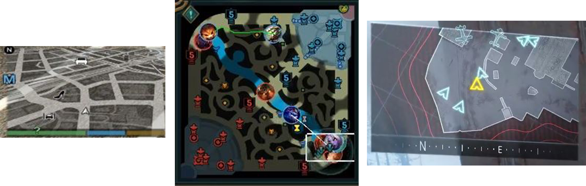
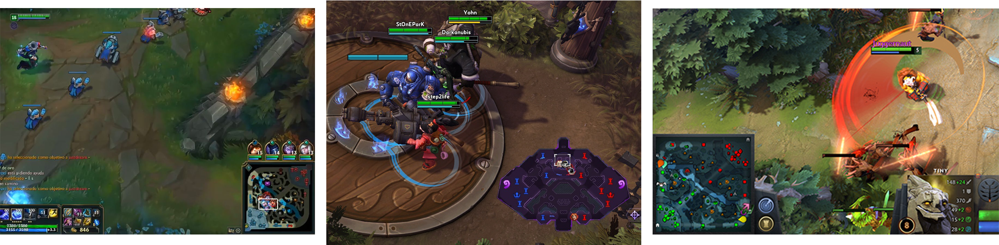

“I am [Òscar Faura](https://www.linkedin.com/in/ofaura21/ "LinkedIn"), student of the [Bachelor’s Degree in Video Games by UPC at CITM](https://www.citm.upc.edu/ing/estudis/graus-videojocs/ "Link to the Degree"). This content is generated for the second year’s subject Project 2, under supervision of lecturer [Ricard Pillosu](https://es.linkedin.com/in/ricardpillosu "LinkedIn").”

# What is a Minimap?
A minimap is an element of the HUD usually placed at a screen corner that represents a map, but its size is much smaller. The function of a minimap is to help the player get orineted.

The common elements usually included in minimaps are the position of the player, the allies and enemies, buildings, terrain, and points of interests. Elements that are not visible for the player, should not appear in the minimap.   

# Where should it be located?
Depending on the videogame genre, there are some conventions on where to locate the minimap.
* **MOBA games** place the minimap at the bottom.

* **Strategy games** usually place the minimap at the bottom left.
* **MMORPG's** place the minimap at the right and mostly at the top.
* **Racing games** place the minimap at the left.
* **FPS** mainly place the minimap at the left.