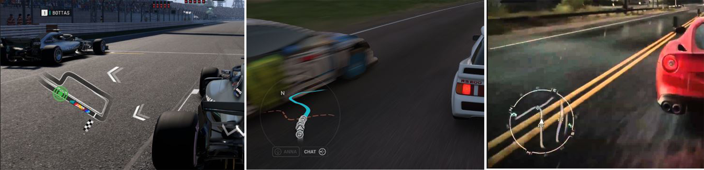
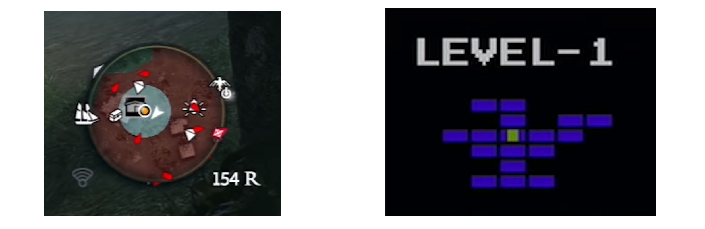

“I am [Òscar Faura](https://www.linkedin.com/in/ofaura21/ "LinkedIn"), student of the [Bachelor’s Degree in Video Games by UPC at CITM](https://www.citm.upc.edu/ing/estudis/graus-videojocs/ "Link to the Degree"). This content is generated for the second year’s subject Project 2, under supervision of lecturer [Ricard Pillosu](https://es.linkedin.com/in/ricardpillosu "LinkedIn").”

# What is a Minimap?
A minimap is an element of the HUD usually placed at a screen corner that represents a map, but its size is much smaller. The function of a minimap is to help the player get orineted.

The common elements usually included in minimaps are the position of the player, the allies and enemies, buildings, terrain, and points of interests. Elements that are not visible for the player, should not appear in the minimap.   

# Where should it be located?
Depending on the videogame genre, there are some conventions on where to locate the minimap. But there are always exceptions.

* **MOBA games** place the minimap at the bottom.

* **Strategy games** place the minimap at the bottom left.

* **MMORPG's** place the minimap at the right and mostly at the top.

* **Racing games** place the minimap at the left.

* **FPS** mainly place the minimap at the left.

# Old vs Modern Minimaps. Pros and Cons
The old minimaps where more effective, they show you where the player is so he can get to acknowledge of surrounding to get somewhere new. Minimaps like this are simple but they work, they do not tell you where do you have to go, so they do not make feel things linear and encourages the player to explore.
With modern games, the minimap shows where every enemy is and also provides the layout of an area without letting you explore it first. This removes the element of surprise when the enemies attack you and also a part of discovery. You can basically play the game looking to the minimap, and that is the major problem. The player spends a lot of the time looking to the minimap and not to the whole screen.
 

